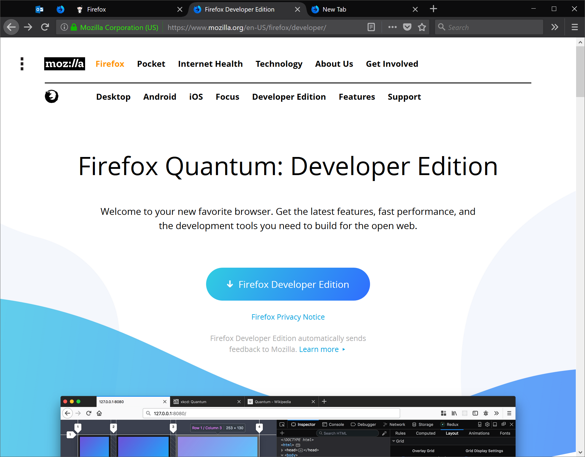
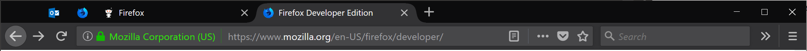

# 🐺 Photon Australis
Bringing sexy curves back to Firefox Photon AND Proton.

# **NOTE**: This project is no longer active.

 
 
 

 
 
 

## Why?
Because all you sexy Firefox users deserve something sexier than ugly, blocky square. (Who wants to be square, right?)

## ⚠ Support note ⚠:
This is a ***NEW*** release that supports Firefox Proton (version 89+). If you are running an older version of Firefox with Photon, please visit [this link](https://github.com/wilfredwee/photon-australis/tree/0.10).

This is regular used and tested by me in these following configurations:
1. Firefox Developer Edition on Dark Theme + Windows 10 on Dark Theme.
1. Firefox Developer Edition on Default Theme + MacOS on Dark Theme.

## 😍 How do I get this sexy thing? 😍
Since Firefox 57+, the only way to customize your browser UI is through `userChrome.css`. Learn more [here](http://kb.mozillazine.org/index.php?title=UserChrome.css&printable=yes).

### General Instructions:
1. Go to your Firefox browser, type `about:config` in your url bar.
1. Search for `toolkit.legacyUserProfileCustomizations.stylesheets` and set it to `true`
1. Type `about:profiles` in your url bar.
1. Under the profile that is in use (The message is something like `This is the profile in use and it cannot be deleted.`), click `Open Folder` on the `Root Directory` row.
1. If that folder does not have a `chrome` folder, create a folder, name it `chrome`.
1. In the `chrome` folder, create a file named `userChrome.css`
1. Determine what Firefox theme you are using:
    1. Click the icon with 3 lines on the top right corner to open the context Menu.
    1. Select `Customize`.
    1. At the bottom left of your screen, select `Themes`.
    1. Choose or determine which theme you want to use, they can either be `Dark`, `Default`, or `Light`.
1. Copy and paste the code that matches your Firefox theme: [Dark](./userChrome-dark.css), [Default](./userChrome-default.css), [Light](./userChrome-light.css) into your `userChrome.css` file that you have created.
 **WARNING:** Newer versions of Firefox with Mojave or Windows 10 Dark Mode will cause Firefox to use the `Dark` theme by default. In this case, you should use the [userChrome-dark.css](./userChrome-dark.css) theme.
1. Restart Firefox and enjoy some sexy curves :D

### Special Instructions for Default Theme users:
If you are using the [Default Theme](./userChrome-default.css) but your MacOS is using the Dark Theme, you can go to `about:config` -> search for `ui.systemUsesDarkTheme` and **ADD** (click the '+' sign) a ***Number***. Set the value to `0`. Restart the browser.

## 😞 Something is broken 😞
Fell free to create an [issue](https://github.com/wilfredwee/photon-australis/issues/new) and I'll see what I can do. However, I'm unable to guarantee quick (or any) responses as this project is in maintenance mode.

## FAQ
### How do I add back tab separators and borders around the tabs?
Please follow these instructions created by a helpful Redditor: https://www.reddit.com/r/FirefoxCSS/comments/bzd5dz/help_with_australis_css/

### Nothing has changed for me
Make sure that your file extension for `userChrome.css` is correct. Most likely a problem for Windows, refer to [this issue](https://github.com/wilfredwee/photon-australis/issues/104). 
